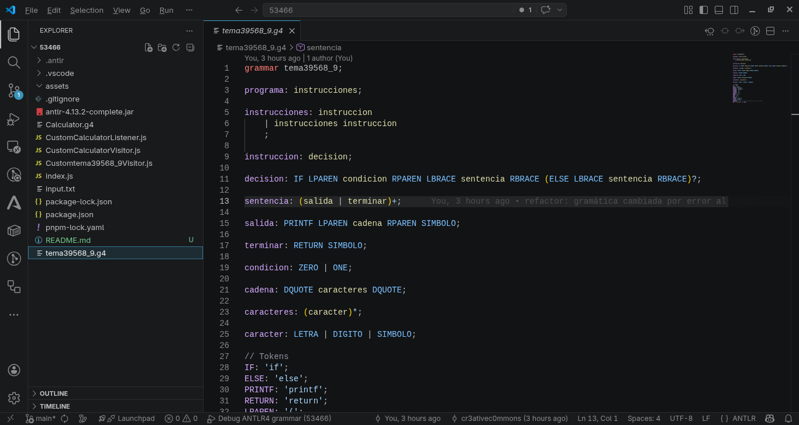
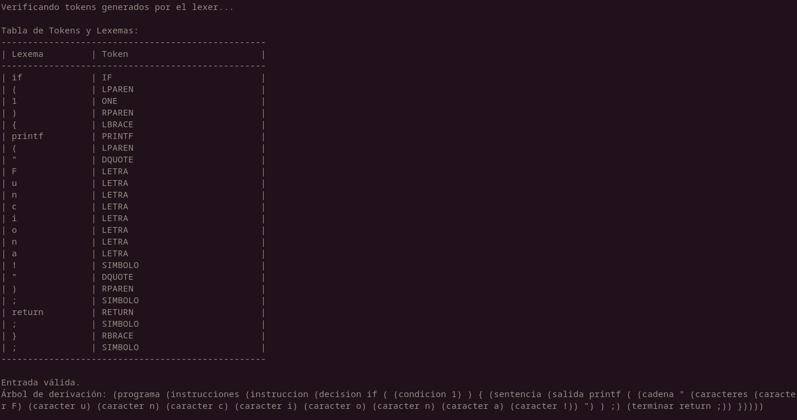

# Analizador de cadenas basado en JS, usando gramáticas en ANTLR4.

Este proyecto de se encarga de analizar cadenas escritas en un sub-lenguaje de C.

## Casos de uso

- Análisis sintáctico y léxico sobre el código fuente: Informa si la entrada es correcta o incorrecta. En caso de ser incorrecta, muestra en qué linea está presente el problema.
- Tabla de lexemas-tokens: Presenta una tabla poblada con lexemas y sus respectivos tokens.
- Árbol de análisis sintáctico: Gracias al poder de ANTLR4, es posible representar un árbol de análisis sintáctico de la entrada.

## ¿Cómo usarlo?
Para empezar, necesitas tener instaladas las siguientes herramientas:
- NodeJS.
- VS Code.
  - Extensión de ANTLR4 y configurada para el proyecto.

- Git.

### Pasos para ejecutar (instrucciones hechas para sistemas UNIX-like)

1. Necesitas clonar el proyecto en el directorio de tu preferencia.
```bash
$ git clone https://github.com/cr3ativec0mmons/53466.git
```

2. Una vez clonado el proyecto, debes de acceder a su directorio.
```bash
$ cd 53466
```
3. Abre el proyecto en VS Code.
```bash
$ code .
```
4. Antes de ejecutar el proyecto, necesitas dirigirte al archivo de gramática (```tema39568_9```) y presionar ```Ctrl+S``` para que se generen los archivos de ejecución.

5. Una vez hecho, podemos iniciar la ejecución del programa.
```bash
$ npm start
```
6. Se le pedirá insertar una cadena si es que no ha presentado alguna en un archivo ```input.js```. Se recomienda probar con los ejemplos presentado en la carpeta ```ejemplos```
## Ejemplo del programa en ejecución


### Cadena usada para la muestra:
```bash
if (1) {
    printf("Funciona!");
    return;
};
```
